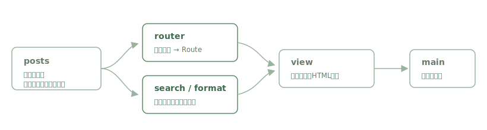

# しょせき

[](https://github.com/miruky/shoseki/actions/workflows/ci.yml)
[](https://www.typescriptlang.org/)
[](https://vitest.dev/)
[](https://opensource.org/licenses/MIT)

**読んだ本の感想を書き留める、緑を基調とした静かな読書ブログです。**

## 概要

本の感想記事を、書影・5段階評価・タグ・読了時間とともに表示する一人用の読書ブログです。記事はデータとして持ち、一覧・記事詳細・タグ絞り込み・全文検索・年別アーカイブ・関連記事をすべてクライアントサイドで完結させます。本文は軽量マークダウンで書け、見出し・引用・箇条書き・強調・リンクに対応します。サーバーもデータベースも使わず、静的ファイルだけで動きます。

書影や星はすべてSVGを手続きで生成しており、画像ファイルを持ちません。落ち着いた緑と明朝体を基調に、長文の感想を読み続けても疲れにくい配色と行間に整えています。

読む: https://miruky.github.io/shoseki/

### なぜ作ったのか

読書記録のサービスは数多くありますが、感想を「文章として」じっくり書き、後から静かに読み返す場所が欲しくて作りました。点数を競うのではなく、読んだ時期ごとの心境の違いを言葉で残すことを主役にしています。装飾を抑え、本文と書影だけがそっと置かれている佇まいを目指しました。

## 機能

- 記事一覧(注目記事+新着)とタグクラウド
- 記事詳細(書影・5段階評価・読了時間・タグ・関連記事・前後の記事への移動)
- タグによる絞り込み
- 全文検索(タイトル・書名・著者・本文を重み付けして検索)
- 年別アーカイブ
- 軽量マークダウンによる本文記述
- 記事を読み進めた割合を示す進捗バー
- 緑基調の配色、自動・ライト・ダークのテーマ切替、レスポンシブ表示

## アーキテクチャ



感想は `posts` にデータとして置き、`router` がハッシュをルートに変換、`view` が各画面のHTMLを組み立て、`main` が描画と遷移を担います。検索・整形・マークダウン変換・ルート解析はいずれもDOM非依存の純粋な関数で、ブラウザなしでテストしています。

## 技術スタック

| カテゴリ | 技術 |
|:--|:--|
| 言語 | TypeScript 5(strict) |
| ビルド | Vite |
| ルーティング | ハッシュベース(依存なし) |
| テスト | Vitest(38テスト) |
| リンタ | ESLint + Prettier |
| CI / CD | GitHub Actions |
| 配信 | GitHub Pages |

## プロジェクト構成

- `src/types.ts` — 記事の型定義
- `src/posts.ts` — 感想記事のデータ
- `src/markdown.ts` — 軽量マークダウンのHTML変換(XSS対策つき)
- `src/search.ts` — 全文検索とタグ集計
- `src/navigation.ts` — 記事の前後(新しい・古い)の算出
- `src/format.ts` — 日付整形・読了時間
- `src/router.ts` — ハッシュとルートの相互変換
- `src/theme.ts` — 自動・ライト・ダークのテーマ切替
- `src/icons.ts` — 星評価・書影などのSVG生成
- `src/view.ts` — 画面ごとのHTML生成
- `src/main.ts` — 全体の組み立て・遷移・テーマ・読書進捗
- `docs/architecture.svg` — アーキテクチャ図

## はじめ方

### 前提条件

- Node.js 20 以上

### セットアップ

```bash
git clone https://github.com/miruky/shoseki.git
cd shoseki
npm install
npm run dev
```

### テストの実行

```bash
npm test
```

### Lintの実行

```bash
npm run lint
```

### デプロイ

`main` ブランチへのプッシュで GitHub Actions がビルドし、GitHub Pages へ配信します。

## 設計方針

- **記事はデータ** — 感想を構造化データとして持ち、表示は純粋関数で組み立てる
- **ロジックの分離** — 検索・整形・マークダウン・ルート解析をDOM非依存にし、テストで担保する
- **安全なマークダウン** — 本文を一度エスケープしてから記法を適用し、`javascript:` リンクは無効化する
- **アセットレス** — 書影も星もSVGで生成し、画像ファイルを持たない
- **静けさを保つ配色** — 緑基調のトークンを1か所に置き、`prefers-color-scheme` で同じ落ち着きのままダークへ追従する。テーマは手動でも切り替えられ、選択を記憶する

## 制約

コメント投稿やいいねといった双方向機能、RSS配信は、サーバーを持たない静的版では扱いません。感想記事はリポジトリのデータとして管理します。

## ライセンス

[MIT](LICENSE)
